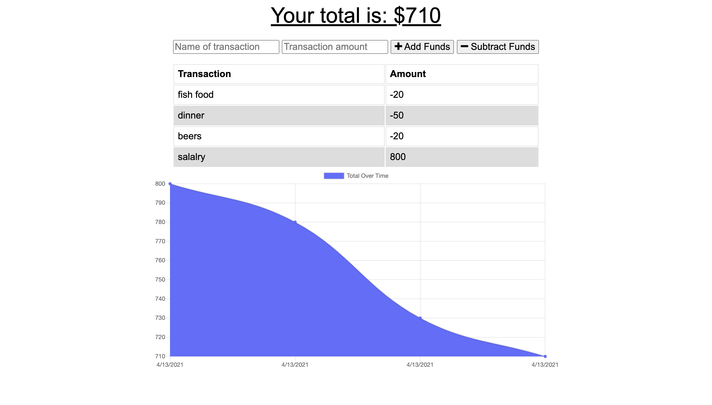

# Simple Online/Offline Budget Tracker

This progressive web application (PWA) uses a remote server, mongo database and IndexedDB to manage a list of transactions adding or substracting money from your balance. The app works offline with IndexedDB and sends any pending transactions to the database once back online.

[See deployed application.](https://dry-plains-25838.herokuapp.com/)

 # Table of contents
 - [Motivation](#motivation)
 - [Built with](#built-with)
 - [Features](#features)
 - [Installation](#installation)
 - [Roadmap](#roadmap)

## Motivation
As an avid traveller, a no fuss and simple app that you can use online and offline to track your expenses and stick to your budget is necessary and useful.

## Built with
- [Node.js](https://nodejs.org/en/)
- [Express](https://expressjs.com/)
- [MongoDB](https://www.mongodb.com/)

## Features
The application allows the user to add transactions to add or substract funds from their budget and displays the changes over time in a chart. Being a progressive web app, it can take data while the browser is not online, and save it to send to the database once the app is back online. This feature is very useful for travellers overseas that may not have access to the internet all the time.
###  [See deployed application.](https://dry-plains-25838.herokuapp.com/)

## Installation
To install this application locally, download the package, and install the necessary dependencies by navigating to the application folder in your terminal and running `npm install`. Now you are ready, start the server from the folder using `node server.js` command. When the connection is established, visit `http://localhost:3000/` from your browser to go to the application.

## Roadmap
Future updates for this application include updating the UI design and making it more user friendly, as well as adding transaction categories.
